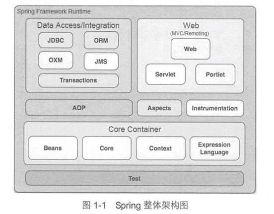

1.1 spring整体架构
==================
+ 软件架构（software architecture）就是软件的基本结构
   + 分层架构
   + 事件驱动架构
   + 微核架构／"插件架构"
   + 微服务架构
   + 云架构
+ Spring框架是一个分层架构  

+ Core Container
  + Beans和Core模块提供IoC和DI特性，这里的基础概念是BeanFactory,它提供Factory模式的经典实现来消除对程序性单例模式的需要，并真正允许你从程序逻辑中分离出依赖关系和配置
+ Data Access/Integration
+ Web
+ AOP